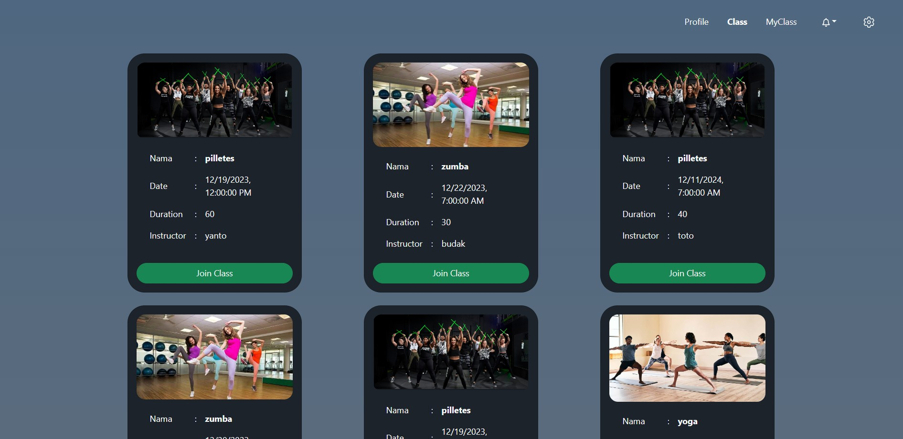

# Gympal
Gympal adalah platform perangkat lunak dari sebuah tempat gym yang dapat digunakan oleh user untuk mendaftar diri menjadi anggota, membayar , dan mendaftarkan diri ke kelas gym. Aplikasi ini juga dapat digunakan admin dan masuk ke interface admin untuk mengelola kelas, mengelola pembayaran, dan mengelola membership anggotanya. Platform ini dibuat menggunakan React + JavaScript XML (JSX) dengan node js sebagai backendnya. Platform ini dibuat untuk memenuhi tugas besar mata kuliah Rekayasa Perangkat Lunak dengan model pengembangan metode waterfall.

Aplikasi ini telah dilakukan deployment melalui azure container apps dengan
+ link [azure.Gympal.api](https://gympalfinal.whitesand-21748554.australiaeast.azurecontainerapps.io)

Juga dilakukan deployment melalui vercel app dengan
+ link [Gympal.vercel.app](https://gympal-d0cr30ome-alans-projects-4d569363.vercel.app/)

## Overview Feature:
- Bootstrap
- Dockerized
- Loading state
- HTTP Client with Axios
- Token with cookies
- Jsonwebtoken

## Screenshot:
### Login
 

### Register
 

### Profile - User
 

### Daftar Kelas - User
 

### Payment
 

### Daftar Kelas - admin

### Edit Kelas
 

### Payment Verification
 

### Membership

## Pembagian Tugas
1. **Login:** 18221144, 18221128
2. **Register:** 18221144, 18221076
3. **Mengatur Jadwal:** 18221076, 18221056
4. **Mengelola Akun:** 18221076, 18221128
5. **Pembayaran:** 18221056, 18221144
6. **Verifikasi Pembayaran:** 18221056, 18221076
7. **Mendaftar Kelas:** 18221128, 18221056
8. **Melihat Kelas:** 18221128, 18221144
